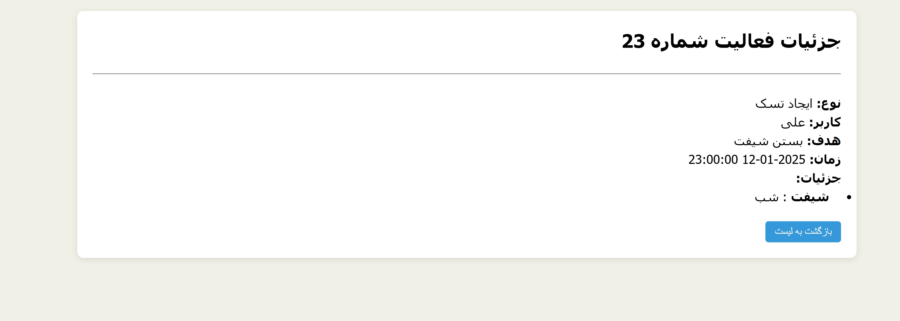

# Smart Activity Project

This project has two main parts:

## Table of Contents
1. [Simple Show](#simple-show)
2. [Use Dockerized Project](#use-dockerized-project)
3. [Install Laravel and Requirements](#1-install-laravel-and-requirements)
4. [Install Vue.js and Requirements](#2-install-vuejs-and-requirements)
5. [SQLite (Optional)](#3-sqlite-optional)
6. [Documentation](#-documentation)

---

### Simple Show
- show list activities
  
- show single activity simple page
  


### use dockerized project
-  Note: The Dockerized version of this project has not been fully tested yet. However, essential steps such as SQLite database creation and installation of required npm packages are already included.

## 🚀 Getting Started

### 1. Install Laravel and Requirements
```bash
composer install
```
- Make sure PHP and Composer are installed.
- If you want to use SQLite, you need to create the database file and run migrations:
```bash
php artisan migrate
  ```z

### 2. Install Vue.js and Requirements

```bash
npm install
npm run dev
nprm run build // production mode
```
### 3. SQLite (Optional)

- The project works with both JSON and SQLite databases.
- For SQLite, running Laravel migrations is mandatory:
```bash
php artisan migrate
  ```

### 📚 Documentation
- from install and prepare  on windows project laravel (powershell)
```PowerShell
# Run as administrator...
Set-ExecutionPolicy Bypass -Scope Process -Force; [System.Net.ServicePointManager]::SecurityProtocol = [System.Net.ServicePointManager]::SecurityProtocol -bor 3072; iex ((New-Object System.Net.WebClient).DownloadString('https://php.new/install/windows/8.4'))
```
- adn linux
```PowerShell
/bin/bash -c "$(curl -fsSL https://php.new/install/linux/8.4)"
```

[Laravel Documentation installation](https://laravel.com/docs/12.x/installation)
